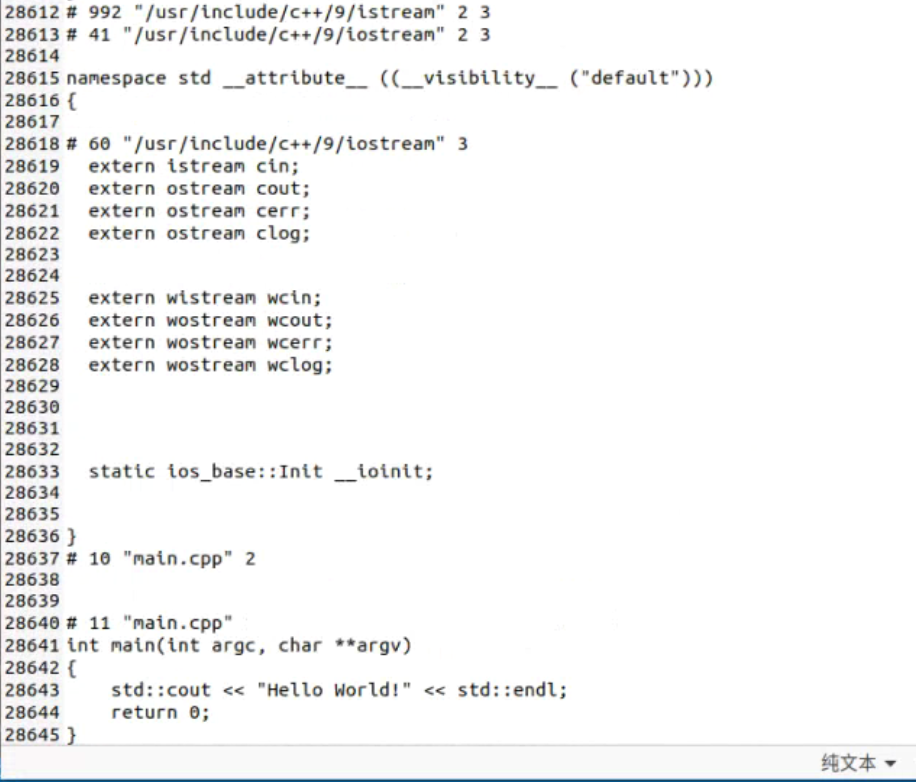

# C++编译详解

------

C++的编译过程包括：

1. 编译预处理
2. 编译
3. 汇编
4. 链接


## 示例代码

------

main.cpp

```c++
#include <iostream>

int main (int argc, char **argv)
{
    std::cout << "Hello world" << std::endl:
    return 0;
}
```


## 编译预处理

------

主要对包含的头文件（#include）和宏定义（#define...）还有注释等进行处理。

可以使用`g++ -E`让g++在预处理后停止编译过程，生成`*.ii`文件。

```shell
g++ -E main.cpp -o main.ii
```



预编译完成后，`#include`引入的内容被全部复制进预编译文件中，除此之外，如果文件中有使用宏定义也会被替换处理。

- 预编译过程最主要的工作，就是宏命令的替换
- `#include`命令的工作就是全部复制进预编译文件中
- 生成`*.ii`时会把注释统统去掉


## 编译

------

#### 编译阶段会进行**语法错误**的检查，在检查无误后，g++ 把代码翻译成汇编语言，生成文件`*.s`。

```shell
g++ -S main.ii -o main.s
```


## 汇编

------

正式将汇编代码生成机器可以执行的目标代码，也就是二进制码。

```shell
g++ -c main.s -o main.o
```

此时`#include <iostream>`的.h文件内容已经加进来，还并未链接到`iostream`的.cpp文件，所以还需要第四部的链接。


## 链接

------

链接的过程，其核心工作是解决模块间各种符号(变量，函数)相互引用的问题，更多的时候我们除了使用.o外，还将静态库和动态库链接一同链接生成可执行文件。

对符号的引用本质是对其在内存中具体地址的引用，因此确定符号地址是编译，链接，加载过程中一项不可缺少的工作，这就是所谓的符号重定位。本质上来说，符号重定位要解决的是当前编译单元如何访问「外部」符号这个问题。

```shell
g++ main.o -o main #没有-o main的话，默认名是a.out
```


| 操作       | 指令                       | 格式                  | 目标编码形式         | 主要步骤                                      |
| ---------- | -------------------------- | --------------------- | -------------------- | --------------------------------------------- |
| 编译预处理 | g++ -E main.cpp -o main.ii | `*.ii`(C语言是`*.i`)  | 预处理后的源文件     | 宏定义、头文件、条件编译（g++标准选择）、注释 |
| 编译       | g++ -S main.ii -o main.s   | `*.s`                 | 汇编语言             | 检查语法，将预处理后文件编译生成汇编文件      |
| 汇编       | g++ -c main.s -o main.o    | `*.o`                 | 目标文件（二进制码） | 将汇编文件生成目标文件（二进制文件）          |
| 链接       | g++ mian.o -o main         | `*`(Windows是`*.exe`) | 二进制               | 把库文件链接到最终的可执行程序中去            |

一步编译：`g++ main.cpp -o main` 或者 `g++ -o main main.cpp`

`-o filename`，指定生成的输出文件名位filename

